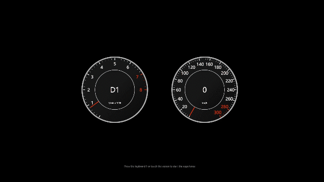

## Car Dashboard Experiment

Car Dashboard Experiment with CSS and React

汽车仪表盘，基于 React 主要使用 CSS 实现



#### CLI Commands

```bash
# clone
git clone https://github.com/948764321/car-dashboard.git

# install dependencies
npm install

# serve with live reload
npm run dev

# build for production with minification
npm run build
```

## Licence

MIT

## Author

ChengJian <948764321@qq.com>

## Others

持续更新
